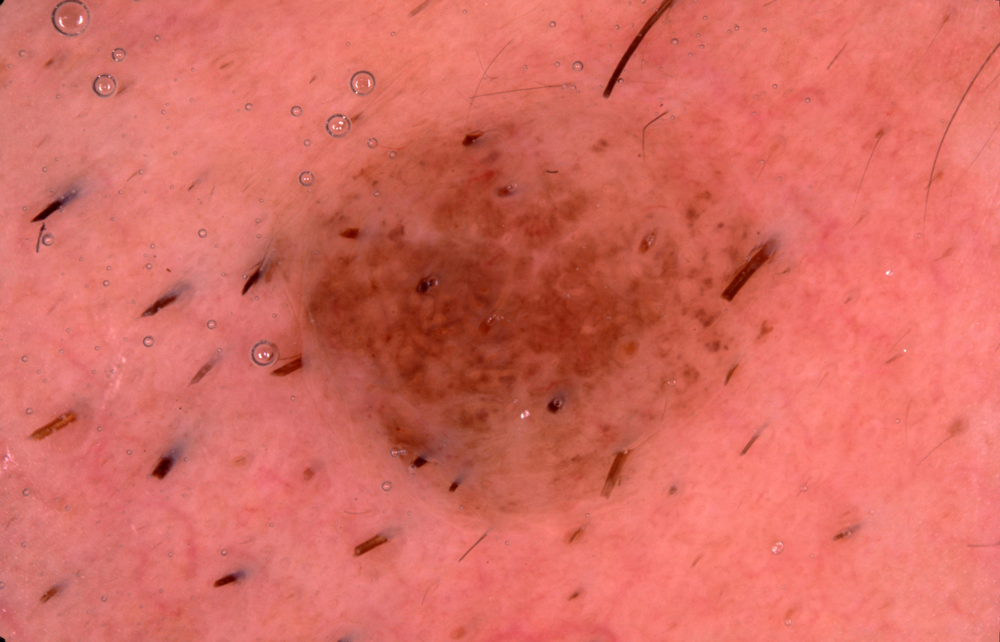
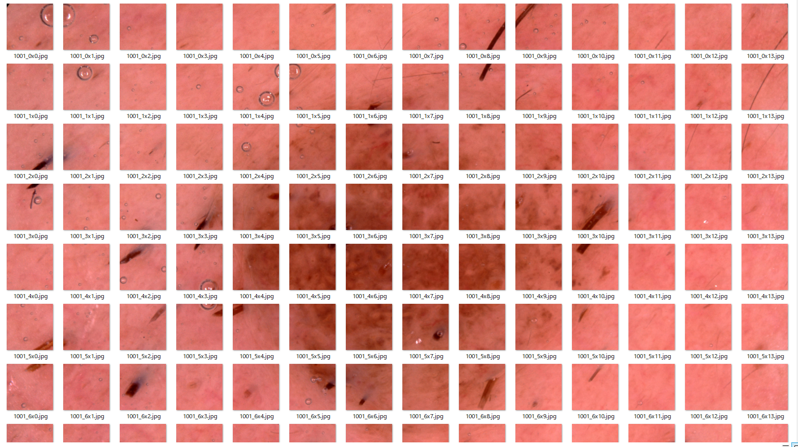
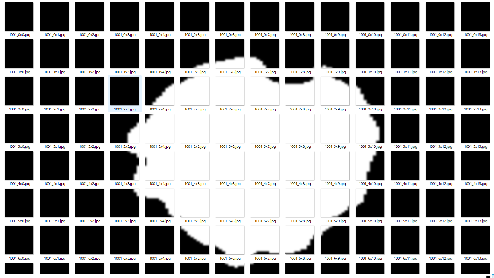
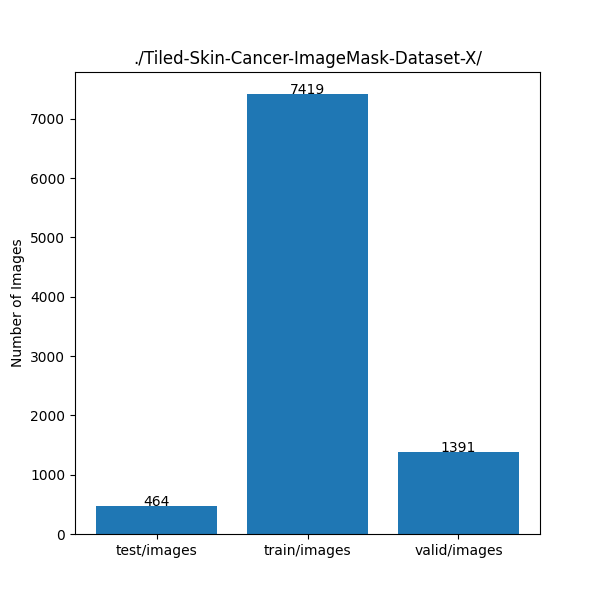
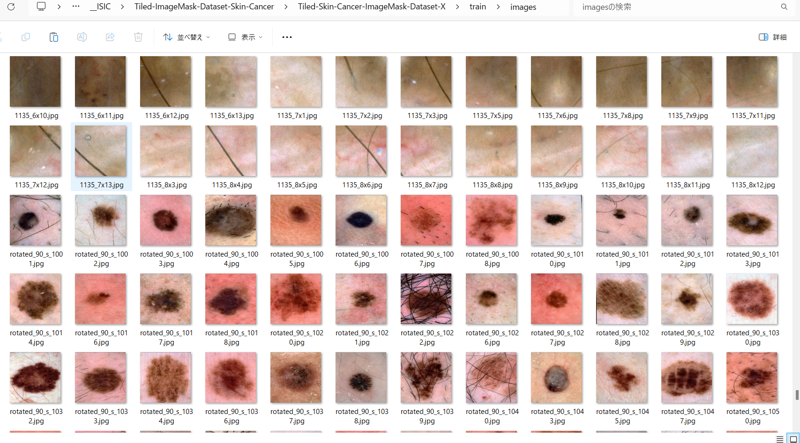
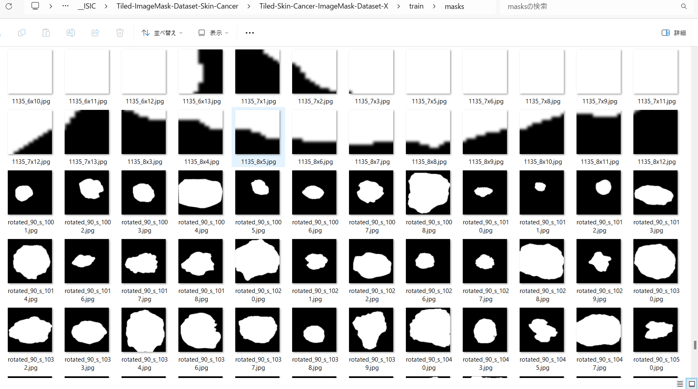

<h2>Tiled-ImageMask-Dataset-Skin-Cancer (2024/05/20) 
</h2>
This is a Tiled-Skin-Cancer ImageMask Dataset for Image-Segmentation. 
<!--
Please see also our first experiment <a href="https://github.com/sarah-antillia/Image-Segmentation-Skin-Lesion">
Image-Segmentation-Skin-Lesion</a>.
-->
 
We have created a tiled image and mask dataset from the original large size image and mask files in 
the following Skin-Cancer Dataset 
 
<a href="https://challenge.isic-archive.com/data/">
ISIC Challenge Datasets 2017
</a>
  
The pixel-size of the original images and masks in 
train, validation and test dataset of ISIC-2017 is from 1K to 6K, 
and too large to use for a training of an ordinary segmentation model.
Therefore we have created a dataset of images and masks, split into small tiles of 512x512 pixels, 
which can be used by a segmentation model.  
<!--
By training a segmentation model by the new tiled dataset, we will try to improve segmentation accuracy for the 
large Skin-Cancer images of 4K or 6K pixel size.    
 -->
 
For example, ISIC-0014680 image and mask of 7168x4608 pixel-size can be split to the tiles as shown below. 
<b>Image and Mask</b>
<table>
<!--
<tr>
<th>
Image
</th>
<th>Mask</th>
</tr>
-->
<tr>
<td>

</td>
<td>

</td>
</tr>
</table>
 
<b>Tiled Image and Mask</b>
<table>
<!--
<tr>
<th>
Tiled-Image
</th>
<th>Tiled-Mask</th>
</tr>
-->
<tr>
<td>

</td>
<td>

</td>

</tr>
</table>

 
<b>Download Tiled-Image-Mask-Dataset</b> 
You can download our dataset created here from the google drive 
<a href="https://drive.google.com/file/d/1XKNJOfi2_n8ldmtgT_NIex4d0PTq92PR/view?usp=sharing">Tiled-Skin-Cancer-ImageMask-Dataset-X.zip</a>
 

<h3>1. Dataset Citation</h3>

The image dataset used here has been taken from the following web site. 

<pre>
ISIC Challenge Datasets 2017
https://challenge.isic-archive.com/data/
</pre>

<b>Citing 2017 datasets:</b>
<pre>
Codella N, Gutman D, Celebi ME, Helba B, Marchetti MA, Dusza S, Kalloo A, Liopyris K, Mishra N, Kittler H, Halpern A.
 "Skin Lesion Analysis Toward Melanoma Detection: A Challenge at the 2017 International Symposium on Biomedical Imaging (ISBI),
  Hosted by the International Skin Imaging Collaboration (ISIC)". arXiv: 1710.05006 [cs.CV]
</pre>
<b>License: CC-0</b> 
 
See also: 

<a href="https://paperswithcode.com/dataset/isic-2017-task-1">ISIC 2017 Task 1</a> 
<pre>
Introduced by Codella et al. in Skin Lesion Analysis Toward Melanoma Detection: 
A Challenge at the 2017 International Symposium on Biomedical Imaging (ISBI), 
Hosted by the International Skin Imaging Collaboration (ISIC)
</pre>
<pre>
The ISIC 2017 dataset was published by the International Skin Imaging Collaboration (ISIC) as a large-scale dataset 
of dermoscopy images. The Task 1 challenge dataset for lesion segmentation contains 2,000 images for training with 
ground truth segmentations (2000 binary mask images).
</pre>
 

<h3>
2. Download master dataset
</h3>
  Please download the original Test, Train, Valid image and mask dataset <b>ISIC Challenge Datasets 2017</b> from the following link 

<pre>
ISIC Challenge Datasets 2017
https://challenge.isic-archive.com/data/
</pre>

The dataset <b>ISIC-2017</b> has the following folder structure. 

<pre>
./ISIC-2017
├─ISIC-2017_Test_v2_Data
├─ISIC-2017_Test_v2_Part1_GroundTruth
├─ISIC-2017_Training_Data
├─ISIC-2017_Training_Part1_GroundTruth
├─ISIC-2017_Validation_Data
└─ISIC-2017_Validation_Part1_GroundTruth
</pre>
Image  *_Data folders contain jpg image files of various size from 1K to 6K, and mask dataset *_GroundTruth 
folders contain the segmentation png files corresponding to the images in *_Data folders.

<h3>
3. Create Tiled ImageMask Ddataset
</h3>
<h3>
3.1 Select Large Image and Mask files
</h3>
Please run the following command for Python script <a href="./LargeImageMaskFileSelector.py">LargeImageMaskFileSelector.py</a>,
<pre>
>python LargeImageMaskFileSelector.py
</pre>
, by which <b>Large-Skin-Cancer-master</b> dataset is created from the original jpg image files in 
<b>Train*_Data</b> folders and png mask files in <b>*_Train_Part1_GroundTruth</b> folders. 

From the original dataset:
<pre>
./ISIC-2017
├─ISIC-2017_Training_Data
├─ISIC-2017_Training_Part1_GroundTruth
├─ISIC-2017_Validation_Data
└─ISIC-2017_Validation_Part1_GroundTruth
</pre> 
, this script selects the large images and masks files of width >= 6600, and  generate the following images and masks datasets of 
width and height which are minimum integral multiple of 512.
<pre>
./Large-Skin-Cancer-master
 ├─images
 └─masks
</pre>

<h3>
3.2 Create Tiledly Split and Resized Dataset
</h3>

Please run the following command for Python script <a href="./TiledImageMaskDatasetGenerator.py">TiledImageMaskDatasetGenerator.py</a>.
<pre>
>python TiledImageMaskDatasetGenerator.py
</pre>
, by which <b>Tiled-Skin-Cancer-master</b> dataset is created from the <b>Large-Skin-Cancer-master</b>. 
<pre>
./Tiled-Skin-Cancer-master
 ├─images
 └─masks
</pre>

This Python script performs the following image processings on the original images and masks in <b>Large-Skin-Cancer-master</b>.
 
<li>1. Create tiledly split patches (images and masks) of 512x512 from the large image and mask files
  in ./Large-Skin-Cancer-master, and save them to ./Tiled-Skin-Cancer-master.</li>

<li>2. Resize the large images and masks to 512x512, and save to ./Tiled-Skin-Cancer-master.</li>
<li>3. Augment the resized images and mask by rotation operations, and save them to ./Tiled-Skin-Cancer-master
</li>
 
In summary, the <b>Tiled-Skin-Cancer-master</b> dataset contains two types of images and masks: 

Tiled images and masks  : <b>Microscopic segmentation</b>. 
Resized images and masks: <b>Macroscopic segmentation</b>. 
 

<h3>
3.3 Split Tiled Skin Cancer master

</h3>

Please run the following command for Python script <a href="./split_master,py">split_master.py</a>.
<pre>
>python split_master.py
</pre>
, by which <b>Tiled-Skin-Cancer-master</b> is split to test, train and valid datasets. 
<pre>
./Tiled-Skin-Cancer-ImageMask-Dataset-X
├─test
│  ├─images
│  └─masks
├─train
│  ├─images
│  └─masks
└─valid
    ├─images
    └─masks
</pre>

<b>Dataset Statistics</b> 
 

<b>train/images samples:</b> 

 
<b>train/masks samples:</b> 

 

